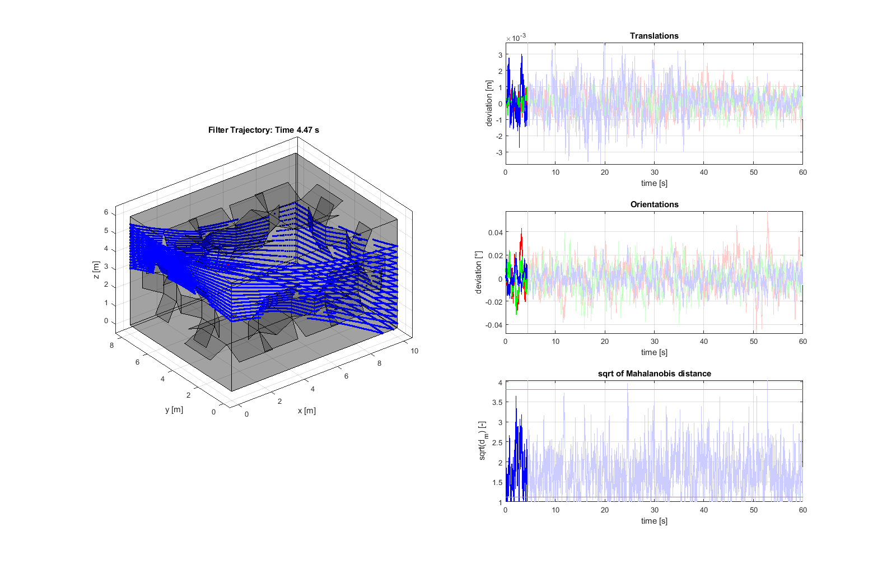
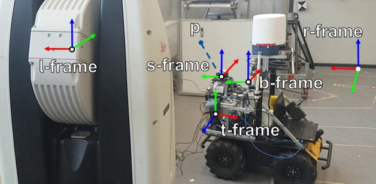

# ErrorStateKalmanFilter_implicitMeas

Copyright (c) 2023 Dominik Ernst -> see LICENSE for further information

## SHORT DESCRIPTION

This repository contains a working demonstrator for a Error State Kalman Filter with implicit measurement equations for the referencing of a multi-sensor system with an LiDAR and IMU. Two different ways of running the code are provided. Either a simulated environment can can be used (code included here) or a real data set acquired in a laboratory can be used ( https://seafile.cloud.uni-hannover.de/d/f3dcf154928e447a93f8/ ).  
The corresponding paper to the algorithm can be found [here](https://arxiv.org/). <- UPDATE LINK TO ARXIV

## USAGE

Two scripts are provided for testing the functionality:
1. `main_visualized.m` (simulation) and `main_real_data.m` run the filter and shows the performance with plots afterwards.
2. `main_multi_runs.m` is useful for parameter studies using computing clusters. The script can perform multiple runs for multiple generated trajectories. The results are saved as MAT-files. The results can be visualized using `plot_result.m` (only for simulations so far)

### Settings for the Filter/Scripts

The settings of the filter and scripts are all located in the script `importInputs.m` (real data) or `importSimulationsInputs.m` (simulated data). These files are included in `.gitignore`. This is aimed to be able to differentiate between different settings for parameter comparisons. Templates for both files with default settings are available. For simple use, these files have to be renamed to have the extension `.m`. Additionally, a prefix for results files from `main_multi_runs.m` can be set to keep an overview over the setting files and the result files.

## EXAMPLES

Example output from `main_visualized.m` (simulation):

## DETAILED DESCRIPTION

### Filter

The estimated states of the filter are the 6-DoF pose of the system, the velocity of the system and the IMU biases for the accelerometer and gyroscope. The orientation is represented using a quaternion.  
The filter uses the IMU observations (accelerations and rotations rates) in a strapdown-fashion for the prediction. The uncertainty of the IMU is included in the process noise.  
The update is performed using the observed LiDAR point clouds, which are assigned to known panels in the environment. States of the filter are updated by minimizing the distances between the points and the panels. Only the points observed since the previous epoch are used. To improve the accuracy of the state estimation, the timestamps of the individual points are used to linearly interpolate between the previous and currently estimated state.

### Simulation

The simulation requires an environment and a trajectory. This repository provides a function for the generation of simple environments, a function for a simple trajectory and a function for the generation of random trajectories. All sensor data is generated without measurement uncertainties. In a second step using a different function, the uncertainties can be added. This enables the usage of these function for efficient Monte Carlo simulations.  
The IMU observations are generated based on the trajectory. For a set sampling rate, 3D accelerations and 3D rotation rates are generated in the sensor frame of the IMU.  
The LiDAR observations are generated based on the trajectory and environment. The implemented function is corresponds the the scanning geometry of a Velodyne Puck. The point generation is performed by simple line-plane-intersections without further geometrical effects, e.g. surface properties or angle of incidence.

### Real Data Set

The real data set is recorded in the 3D lab of the Geodetic Institute Hannover. The Husky UGV was equipped with a sensor platform including a Velodyne Puck and a Microstrain IMU. Five different trajectories with sensor data from both of these sensors and a Laser Tracker measurement as ground truth are available. In the lab, eleven panels are available as known planes for the position tracking. The panels were also measured by the Laser Tracker and thus can be regarded as deterministic.  
The assumption for the filter (for both, the real data set and the simulation) are based on prior calibration measurements on the panels distributed in the room to fulfill the assumptions.

### Performance metrics

The performance of the filter is determined by the accuracy. For the simulation, the true pose of the system is available enabling the computation of the deviations. FOr the real data set, the tracking of the Laser Tracker is used to evaluate the filter performance. Additionally, the root mean square error (RMSE) can be computed. To fully investigate the filter, the Mahalanobis distance is computed, which weights the pose deviations by the VCM of the estimated states.  
These metrics can be visualized using either `main_visualized.m`/`main_real_data.m` or the function `plotDevsMds.m`.